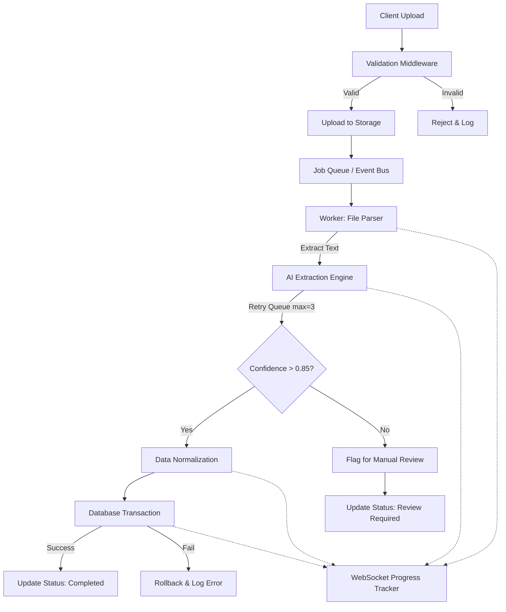

# 2K AI Accounting System - Production Architecture

This document outlines the robust, fault-tolerant backend architecture required to support the Master System Prompt, ensuring 100% receipt parsing and bank import reliability.

## 1. Production Backend Workflow Diagram



## 2. Database Error Logging Schema (Supabase)

```sql
CREATE TABLE system_error_logs (
    id UUID PRIMARY KEY DEFAULT uuid_generate_v4(),
    timestamp TIMESTAMPTZ DEFAULT NOW(),
    process_id UUID NOT NULL,
    module VARCHAR(50) NOT NULL, -- e.g., 'RECEIPT_SCANNER', 'BANK_IMPORT'
    error_type VARCHAR(50) NOT NULL, -- e.g., 'TIMEOUT', 'OCR_FAILED', 'VALIDATION'
    message TEXT NOT NULL,
    stack_trace TEXT,
    payload JSONB, -- The data being processed when it failed
    retry_count INT DEFAULT 0,
    resolved BOOLEAN DEFAULT false
);
```

## 3. Database Transaction Model

All critical parsing and status updates must happen inside an atomic database transaction. If the AI hallucinates bad data or a network drop occurs during saving, the entire database insertion drops instead of corrupting the ledger.

```sql
BEGIN TRANSACTION;
  -- 1. Insert Extracted Receipt Data
  INSERT INTO receipts (...) VALUES (...);
  -- 2. Insert Line Items
  INSERT INTO receipt_items (...) VALUES (...);
  -- 3. Update processing tracking status to 'completed'
  UPDATE file_processing_jobs SET status = 'completed' WHERE id = ...;
COMMIT;
-- On Error: ROLLBACK;
```

## 4. Real-Time Progress Tracker (Status Definitions)

Using the Master System prompt, the frontend listens via Supabase Realtime or WebSockets to this schema update to show the user exact progress without them refreshing:
1. `uploaded`
2. `validating`
3. `parsing`
4. `extracting`
5. `classifying`
6. `saving`
7. `completed` | `failed` | `review_required`
